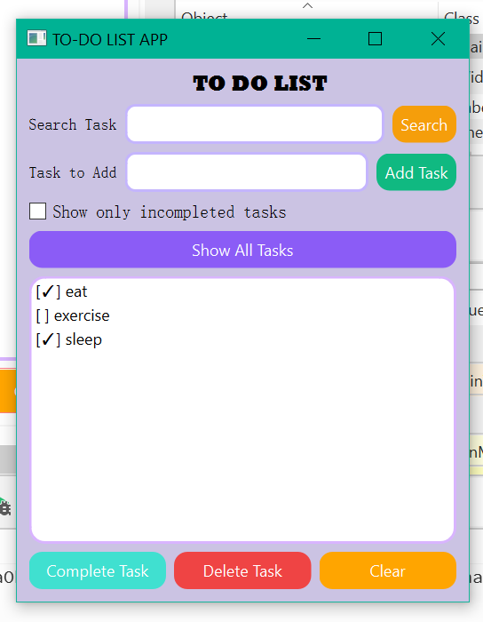

This repository contains two versions of a To-Do List application:

## 1. Console Version
A command-line based to-do application built using C++. Can be run on temrinal.

Location: `console_TODO/`

## 2. GUI Application Version
A desktop application built using C++ and Qt Widgets. A full application experience.

Location: `app_TODO/`

## Features
- Add tasks
- Delete tasks
- Mark tasks as completed
- Save and load tasks
- Search for tasks
- See either all tasks or only the incompleted ones
- Clear all tasks at once

## Technologies Used
- C++
- Object-Oriented Programming
- Qt Widgets
- File Handling

## How to Run the Project

### Prerequisites
- Install Qt Creator and Qt Framework.
- Install a C++ compiler (MinGW).

### Steps
- Clone the repository:
   bash
git clone https://github.com/sana-ahmer/to-do-list-app.git

- Open the project in Qt Creator.

- Build the project.

- Run the application.

## Screenshot

## Future Improvements
- Add task priorities
- Add due dates and reminders
- Filter tasks
- Dark mode support
- Categories for tasks

## 👩‍💻 Author
**Sana Ahmer**  
Computer Science Student | C++ Developer 

---

This project was developed as a learning project to practice C++, Object-Oriented Programming, and GUI development using Qt.